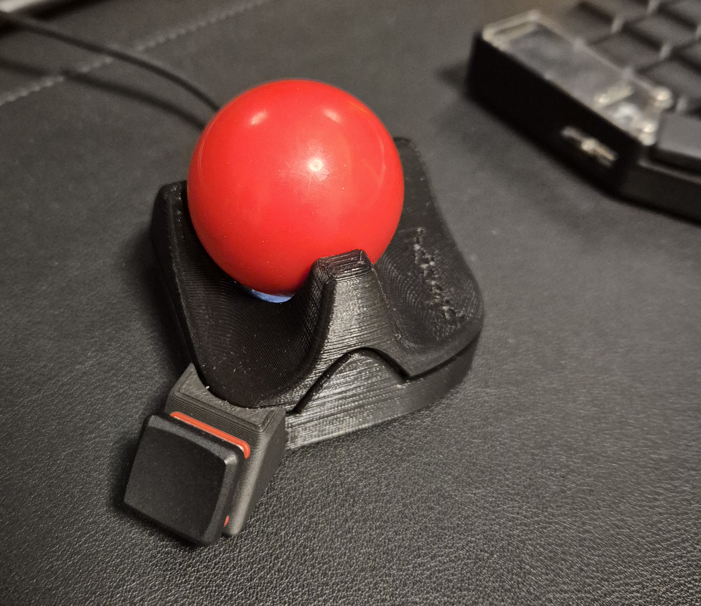
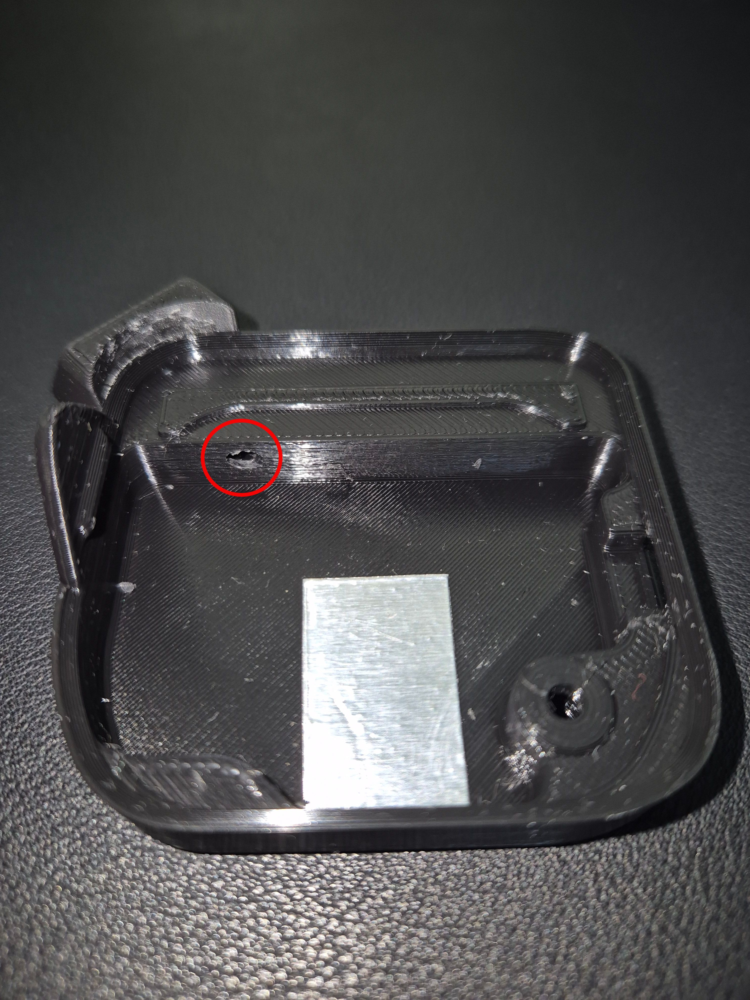
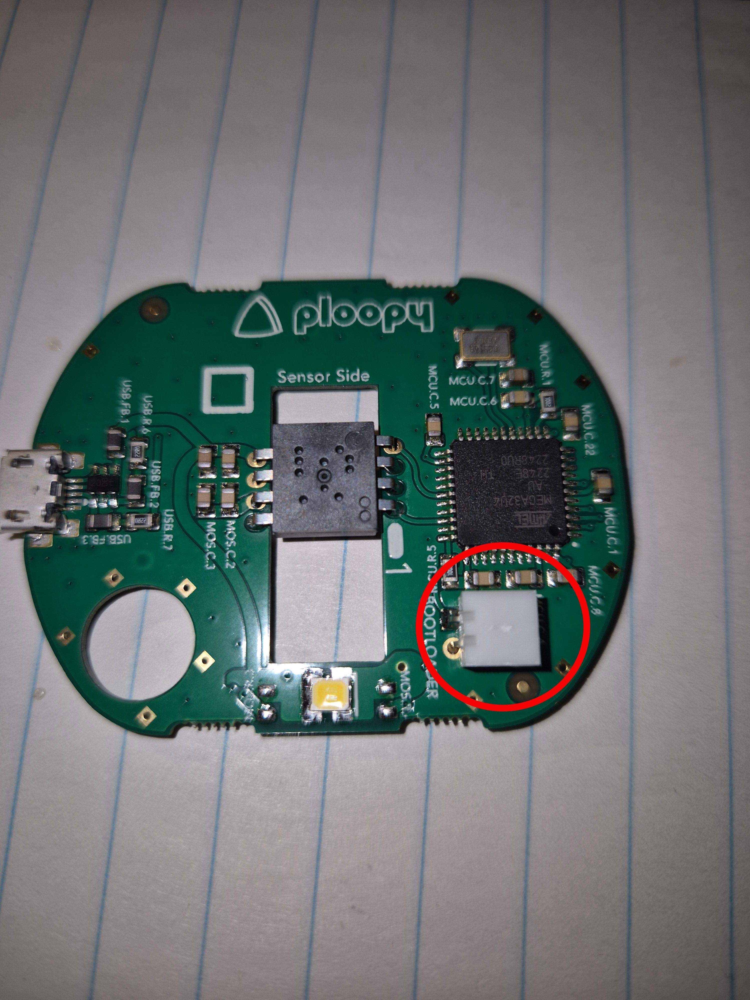
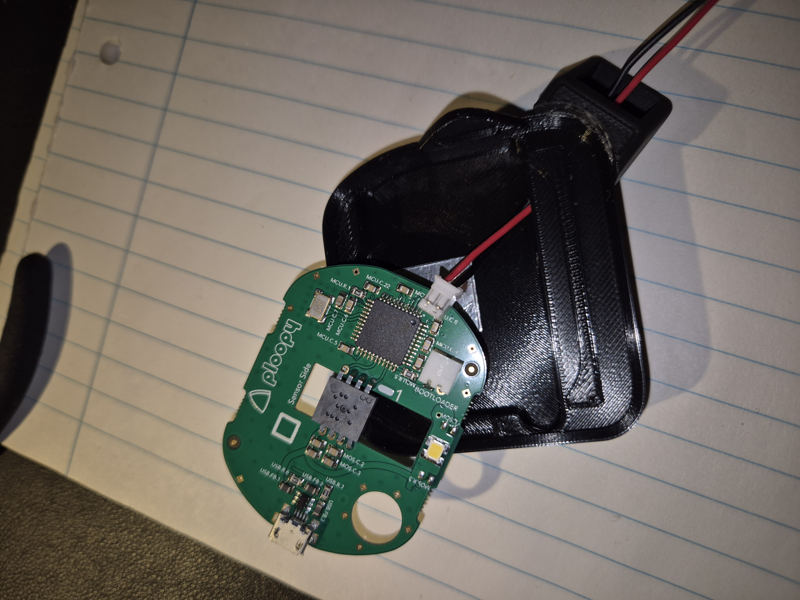
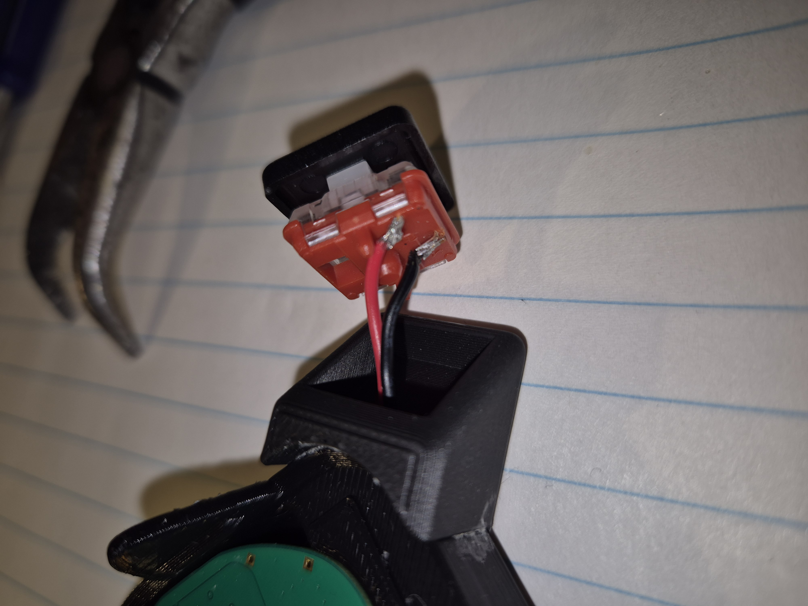
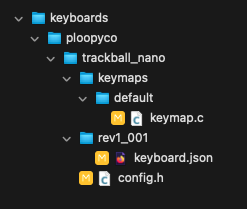
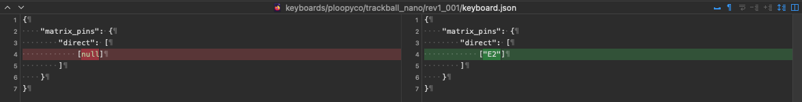
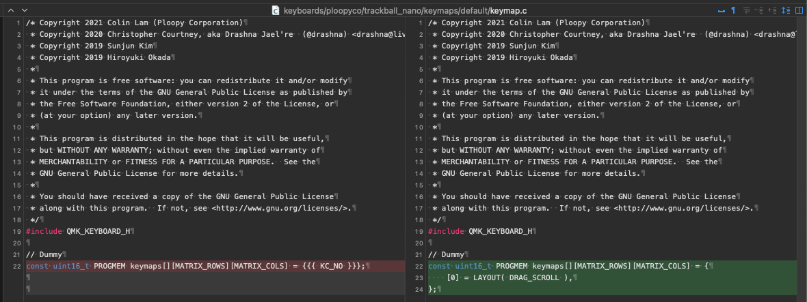
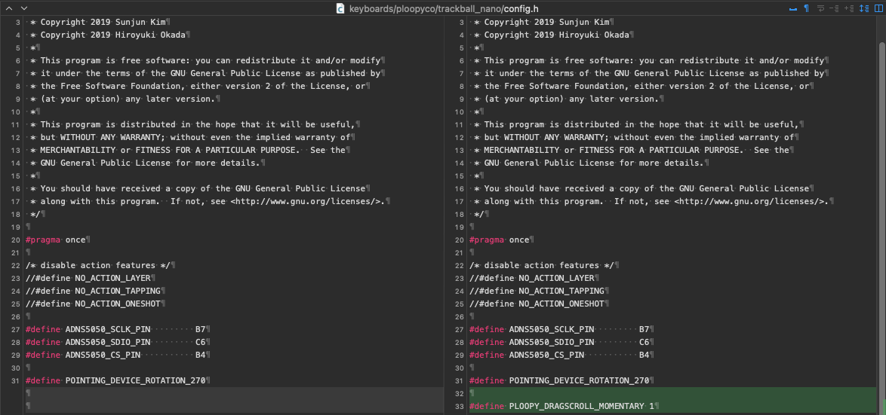

# ploopy-nano-scroll-button

This is a small mod to the [Ploopy Nano trackball](https://ploopy.co/nano-trackball/) that adds a scroll/bootloader button to the Nano.

## About this mod

This mod uses the Ploopy Nano GPIO pin to add a button to the trackball.

I have used the button to activate drag-scroll, but it can be configured to do something else, if you're willing to compile the firmware yourself.

Because the button is connected to the GPIO pin, which is used to put the nano into bootloader mode during startup, then you can also use it to put the nano into bootloader by holding the button during startup (no need to disassemble the trackball everytime you want to flash new firmware 🎉)

## Bill of materials

1. Ploopy Nano, which can be acquired [here](https://ploopy.co/shop/nano-trackball-kit/)
2. Kaihl choc V1 low profile switch
3. 2 small wires (e.g. 22awg)
4. 3mm drill bit and a drill (or whatever you have at hand to drill a 3mm hole through the Ploopy Nano case)
5. Soldering iron and solder wireu
6. Small phillips screwdriver to assemble disassemble the Nano case
7. A 3D printer
8. (Optional) PH-2A and PH-2Y connectors - so you don't need to solder the wires directly to the PCB

## Button insert

I have created a small button insert to be added to the bottom-left corner of the nano. The insert fits a Kaihl choc V1 low profile switch.
I have created 3 different options, but ended up using [the most minimalist one](./stl/button-insert-slim.stl).

You can 3D print one of the files in the stl folder or design your own :).

## Assembling instructions

1. Glue the button insert to the bottom-left corner of the bottom part of the nano case

2. The button has a 3mm hole so you can use that as a guide to drill into the case with a 3mm drill bit and a drill. The hole should look as following:

3. Pass 2 wires through the hole

4. Solder PH-2A connector to the PCB. If you don't have one, you can also solder the wires directly to the PCB. I would recommend using the connector, because it is much easier to remove the PCB, if you want to use it to something else later on.

5. Attach PH-2Y connector to the wires. Skip if you have soldered the wires directly to the PCB

Connect the PH-2Y to the PH-2A, place the PCB into the case and arrange the wires to it is not in the way of the optics.

6. Adjust the size of the wire and solder it to the switch. A hot-swap socket would be awesome, but I did not have one at hand. I am not sure that there is enough space in the button insert to add one (may be possible).

Push the button into the hole and you are ready to reassemble the nano!

## Firmware

I have compiled 2 different versions of the firmware, and both are available under the firmware folder:

### ploopyco_trackball_nano_rev1_001_E2-momentary-drag-scroll

This is the one of that I am using. It has momentary dragscroll, meaning that dragscroll is active while you hold the button. I have also increased the dragscroll divisors to 80, so the scroll is more controllable.

### ploopyco_trackball_nano_rev1_001_E2-drag-scroll

This one toggles dragscroll when you click the button. The dragscroll settings are unchanged.

### Flashing new firmware

[Here](https://docs.qmk.fm/newbs) you can find instructions on how to setup your environment to compile and flash a new version of QMK into you Nano.

If you want to use one of the provided firmware from this repo, you only need to install the QMK toolbox.

To put the Nano in bootloader mode, you can just unplug the Nano, then plug it again while holding the newly added button.

## Firmware changes

The following are the files that you need to change to make the GPIO pin available with dragscroll functionality:

First you need to declare the GPIO pin, which is available as E2, in the `keyboard.json`:

Then you need to create a layout and map the new button to the dragscroll functionality in the `keymap.c`:

Finally, you can configure dragscroll settings, e.g. momentary scroll or divisors in the `config.h`:

